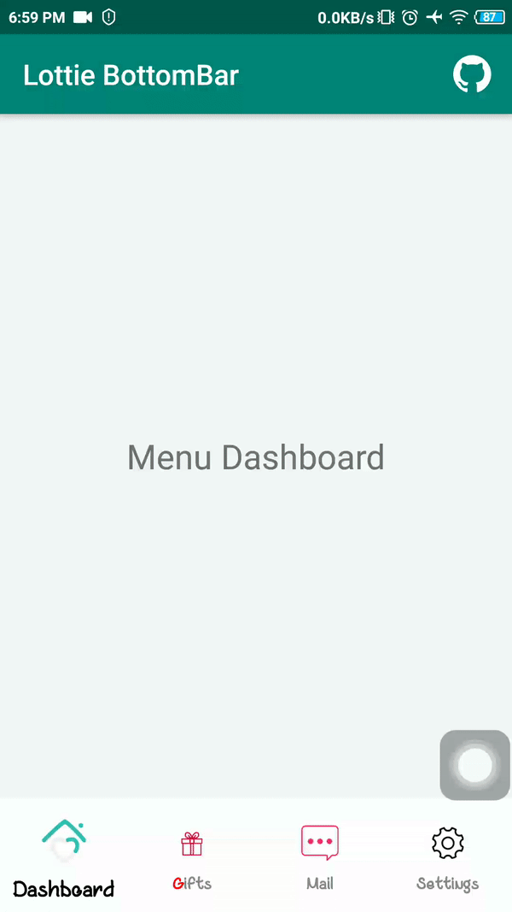
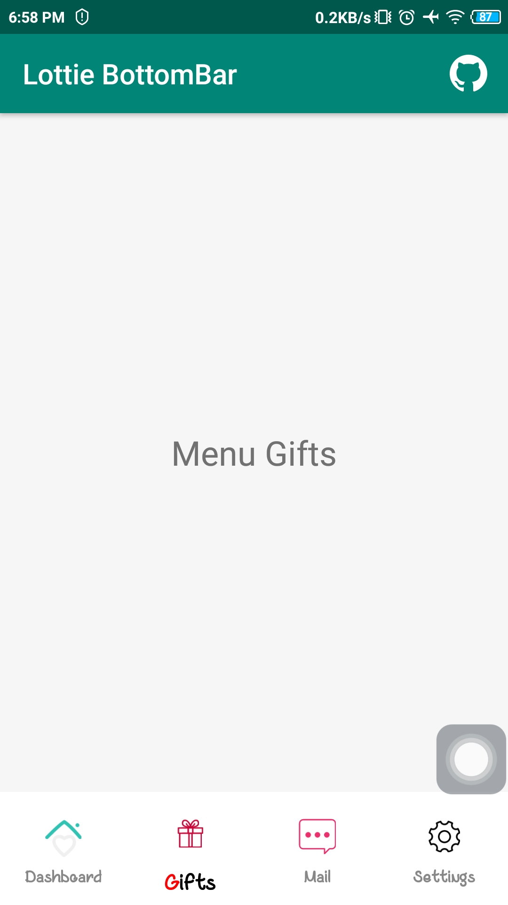
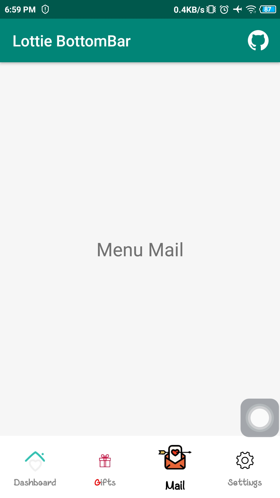
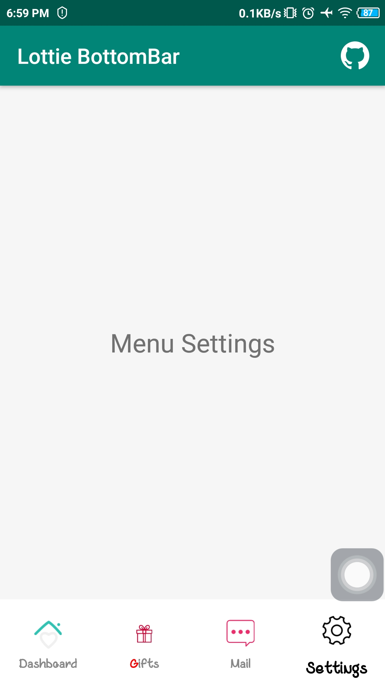

# Lottie BottomBar

[](https://www.android.com)
[](https://www.apache.org/licenses/LICENSE-2.0.html)
[](https://docs.gradle.org/current/release-notes)
[](https://java-lang.github.io/awesome-java)

♻️ A beautiful Lottie Bottom Bar Examples in Java using Library.

# Source
Repo to demonstrate LottieBottomNav in Android app. This is a follow up on the github at :

[LottieBottomNav](https://github.com/wwdablu/LottieBottomNav)

# Instruction

## Gradle
```
allprojects {
    repositories {
        maven { url 'https://jitpack.io' }
    }
}

dependencies {
    implementation 'com.github.wwdablu:lottiebottomnav:x.y.z'
}
```

## Declare in XML
```
<com.wwdablu.soumya.lottiebottomnav.LottieBottomNav
    android:layout_width="match_parent"
    android:layout_height="wrap_content"
    android:id="@+id/bottom_nav"
    android:layout_alignParentBottom="true"
    android:background="@android:color/white"
    app:menu_selected_height="48dp"
    app:menu_selected_width="48dp"
    app:menu_unselected_height="40dp"
    app:menu_unselected_width="40dp"
    app:menu_text_show_on_unselected="true"
    />
```
This would create the LottieBottomNav control. Using it the width and height of the menu items in selected and unselected state of the menu item can be controlled. Also as to whether the text for the menu item will be used for the unselected items can also be controlled using the property `menu_text_show_on_unselected`.

## Creating Menu Items
The LottieBottomNav contains an array of menu items. The process to create a menu item is:
```
MenuItem homeItem = MenuItemBuilder.create("home.json", MenuItem.Source.Assets, fontItem, "dashboard")
    .pausedProgress(1f)
    .loop(false)
    .build();
```
This allows us to create a menu with both the selected and unselected states. The other way to create is from an existing menu item object and then modifying any existing property. `Note: Only tag property is not copied`.
```
MenuItem settings = MenuItemBuilder.createFrom(homeItem)
    .selectedLottieName("settings.json")
    .unSelectedLottieName("settings.json")
    .tag("settings")
    .build();
```
In the above approach properties like `autoPlay` and `loop` are of the same value from which it is created.

## Creating Text Menu Items
These are used to display the text on the menu item. Now, we can also specify custom fonts too.
```
FontItem fontItem = FontBuilder.create("Dashboard")
    .selectedTextColor(Color.BLACK)
    .unSelectedTextColor(Color.GRAY)
    .selectedTextSize(16) //SP
    .unSelectedTextSize(12) //SP
    .setTypeface(Typeface.createFromAsset(getAssets(), "coffeesugar.ttf"))
    .build();
```


## Update a particular menu item
To update a particular menu item with different properties of the menu item, the following approach is needed.
```
MenuItem cupidMessage = MenuItemBuilder.createFrom(bottomNav.getMenuItemFor(index))
    .selectedLottieName("message_cupid.json")
    .tag("cupid")
    .build();

bottomNav.updateMenuItemFor(index, cupidMessage);
```
This would change the lottie used for the menu item in `index` and update it to use cupid lottie.


## Callback
The following callbacks are provided for each of the menu items.
```
void onMenuSelected(int oldIndex, int newIndex, MenuItem menuItem);
void onAnimationStart(int index, MenuItem menuItem);
void onAnimationEnd(int index, MenuItem menuItem);
void onAnimationCancel(int index, MenuItem menuItem);
```
It should be noted that if `autoPlay` is enabled, then it must be noted that `onMenuSelected` will call `onAnimationStart` immediately. So it is better to perform quick tasks in these callback and move heavy tasks in separate threads.

## Notes
**Lottie Files**
The lottie files used have been taken from `https://www.lottiefiles.com/`. The lotties files have been developed by the respective developers and I have not created them.

**Font**
The font has been downloaded from https://www.1001fonts.com/coffee-with-sugar-font.html. I have used them for the purpose of demo.

# Demo App

<p align="center">
  <a href="https://github.com/achmadqomarudin/LottieBottomBar/releases/latest/download/app-demo.apk">
    
  </a>
</p>

<table style="width:100%">
  <tr>
    <th>Example 1</th>
    <th>Example 2</th>
  </tr>
  <tr>
    <td></td>
    <td></td>
  </tr>
  <tr>
    <th>Example 3</th>
    <th>Example 4</th>
  </tr>
  <tr>
    <td></td>
    <td></td>
  </tr>
</table>

# License

```
    Copyright (C) Achmad Qomarudin

    Licensed under the Apache License, Version 2.0 (the "License");
    you may not use this file except in compliance with the License.
    You may obtain a copy of the License at

       http://www.apache.org/licenses/LICENSE-2.0

    Unless required by applicable law or agreed to in writing, software
    distributed under the License is distributed on an "AS IS" BASIS,
    WITHOUT WARRANTIES OR CONDITIONS OF ANY KIND, either express or implied.
    See the License for the specific language governing permissions and
    limitations under the License.
```